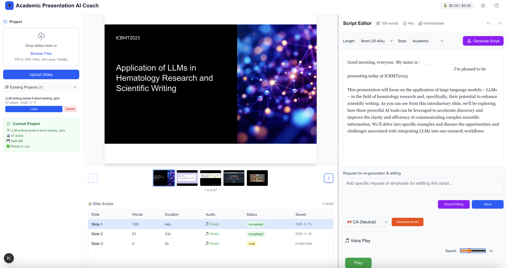

# Academic Presentation AI Coach

AI-powered presentation script generator and voice synthesizer for academic researchers.

Upload your slides, generate natural presentation scripts with AI, and create audio files — all running locally on your machine.



## Features

- **Slide Analysis** — Automatically analyzes slide images using a multimodal LLM
- **Script Generation** — Creates natural English presentation scripts tailored to each slide
- **Smart Editing** — Refine scripts with AI-assisted editing instructions
- **Voice Synthesis** — Generate MP3 audio with 6 voice options (Google TTS)
- **Playback Speed Control** — Adjust audio speed from 0.5x to 2.0x
- **Auto-Save** — Scripts and audio are saved to disk automatically per slide

## Quick Start

### Prerequisites

- [Ollama](https://ollama.ai) with a multimodal model (16GB+ RAM recommended)
- [Node.js](https://nodejs.org) 18+
- [uv](https://docs.astral.sh/uv/) (Python package manager)
- Internet connection (for Google TTS)
- ffmpeg (optional, for speed control)

### 1. Install an Ollama model

```bash
ollama pull gemma3:27b
```

Any multimodal model that supports image input works. To use a different model, set `OLLAMA_LLM_MODEL` in `backend/.env`.

### 2. Run the app

```bash
git clone <repository-url>
cd ai-speaker-simple
./start.sh
```

Open http://localhost:3000 in your browser.

### Stop

Press `Ctrl+C` to stop both servers.

## How to Use

1. **Upload** a PPTX or PDF file from the left panel
2. **Select a slide** from the thumbnail strip
3. **Generate Script** — click the button on the right panel; the AI sees the slide image and writes what you should say
4. **Edit** the script manually or use Smart Editing with instructions
5. **Save** — stores the script to the server
6. **Generate Audio** — creates an MP3 with the selected voice
7. **Play** — listen and adjust speed with the slider

Scripts and audio are saved per slide. Re-saving or re-generating overwrites the previous version.

## Tech Stack

| Component | Technology |
|-----------|-----------|
| Backend | FastAPI (Python) |
| Frontend | Next.js 15 / React 19 / TypeScript |
| LLM | Ollama — gemma3:27b (multimodal) |
| TTS | gTTS (Google Text-to-Speech) |
| File Processing | PyMuPDF, python-pptx, LibreOffice |

## Project Structure

```
ai-speaker-simple/
├── start.sh                 # Launch both servers
├── backend/
│   ├── main.py              # FastAPI app
│   ├── app/
│   │   ├── routers/         # API endpoints (upload, script, voice)
│   │   └── services/        # LLM, TTS, file processing
│   └── data/projects/       # Uploaded slides, scripts, audio (auto-created)
└── frontend/
    └── src/
        ├── app/page.tsx     # Main page
        └── components/      # ControlPanel, SlideViewer, ScriptEditor
```

## API Endpoints

| Method | Endpoint | Description |
|--------|----------|-------------|
| POST | `/api/upload/file/{session_id}` | Upload PPTX/PDF file |
| GET | `/api/upload/projects` | List all projects |
| GET | `/api/upload/project/{id}` | Get project info |
| DELETE | `/api/upload/project/{id}` | Delete project |
| POST | `/api/script/generate-slide` | Generate script for a slide (with image) |
| POST | `/api/script/edit-script` | Smart edit existing script |
| POST | `/api/script/save/{id}/{slide}` | Save script |
| GET | `/api/script/load/{id}/{slide}` | Load saved script |
| GET | `/api/script/list/{id}` | List all scripts for a project |
| POST | `/api/voice/synthesize/{id}/{slide}` | Generate audio |
| GET | `/api/voice/audio-file/{id}/{filename}` | Serve audio file |
| GET | `/api/voice/list/{id}` | List audio files |
| GET | `/api/voice/voice-options` | Available voices |

## Data Storage

All data is stored on the server's local disk under `backend/data/projects/{project_id}/`:

| Action | Location | Format |
|--------|----------|--------|
| Save script | `scripts/slide_001.txt` | Text + JSON metadata |
| Generate audio | `audio/slide_001.mp3` | MP3 (overwritten on re-generate) |
| Upload slides | `slides/slide_001.png` | PNG images |

## Configuration

### Backend (`backend/.env`)

```env
OLLAMA_BASE_URL=http://localhost:11434
OLLAMA_LLM_MODEL=gemma3:27b
ALLOWED_ORIGINS=http://localhost:3000
```

Change `OLLAMA_LLM_MODEL` to use a different multimodal model (e.g., `gemma4:26b`, `llava:13b`).

### Frontend (`frontend/.env.local`)

```env
NEXT_PUBLIC_API_URL=http://localhost:8000
```

Both default to localhost — no configuration needed for local use.

## Manual Setup

If `start.sh` doesn't work, run each server separately:

**Terminal 1 — Backend:**
```bash
cd backend
uv venv && source .venv/bin/activate
uv pip install -r requirements.txt
cp .env.example .env
python main.py
```

**Terminal 2 — Frontend:**
```bash
cd frontend
npm install
npm run dev
```

## Troubleshooting

| Problem | Solution |
|---------|----------|
| Script generation fails | Check that Ollama is running: `ollama serve` |
| Audio generation fails | Requires internet connection for Google TTS |
| Speed control doesn't work | Install ffmpeg: `brew install ffmpeg` |
| Upload fails | Ensure file is PPTX or PDF, max 100MB. PPTX requires LibreOffice |
| Port already in use | `start.sh` finds available ports automatically |

## License

[CC BY-NC 4.0](https://creativecommons.org/licenses/by-nc/4.0/) — Free for non-commercial use with attribution.
